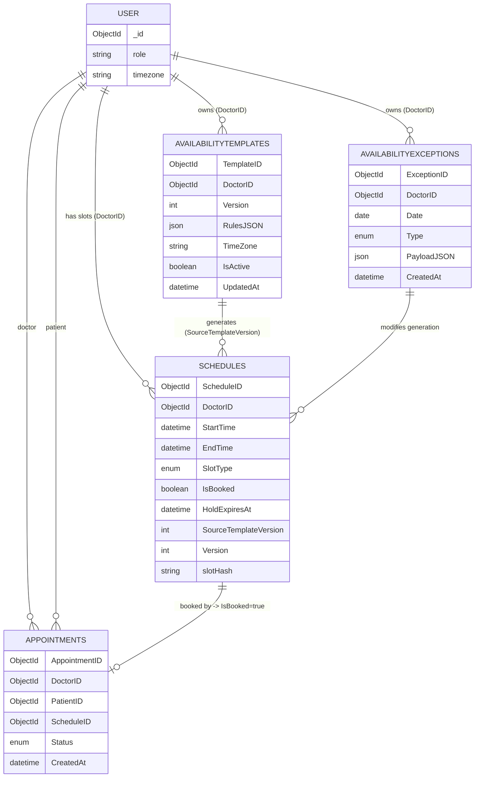

## Doctor Availability & Slot Reservation ERD and Authoring Flow

This document captures the real-time schedule integrity, availability authoring, and slot reservation pipeline described in the Availability Authoring / Publish plan.

### 1. Entity-Relationship Diagram (ERD)



### 2. Tables & Columns (Delta)

See Section A below (copied from spec) for detailed additions.

### 3. Authoring Lifecycle (Draft → Preview → Publish → Regenerate)

Summarized steps:

1. Load current template (Versioned).
2. Client edits locally (no persistence).
3. Preview expansion (server expands recurrence + applies exceptions + filters collisions).
4. Publish transactional diff (AppendMissing | ReplaceUnbooked) with optimistic concurrency (Version match) and template row lock.
5. Nightly/on-demand incremental regeneration keeps rolling horizon filled.

### 4. Concurrency & Integrity

Safeguards: Optimistic version on template, row lock on publish, never delete booked slots, hash-protected slot parameters (slotHash/HMAC), immutable audit trail of exceptions once part of a published window (unless re-published), conservative ReplaceUnbooked logic.

### 5. API Surface (New / Extended)

```
GET  /api/doctors/{doctorId}/availability/template
PUT  /api/doctors/{doctorId}/availability/template
POST /api/doctors/{doctorId}/availability/preview
POST /api/doctors/{doctorId}/availability/publish
GET  /api/doctors/{doctorId}/availability/exceptions?from=&to=
POST /api/doctors/{doctorId}/availability/exceptions
DELETE /api/doctors/{doctorId}/availability/exceptions/{exceptionId}
```

### 6. Validation Highlights

Template: slot length bounds, start<end, daily duration limits, buffer alignment.  
Preview/Publish: horizon cap (e.g. 90 days), timezone validity, no overlapping generated slots, ReplaceUnbooked safety rule.

### 7. Metrics & Audit Hooks

Audit Actions: AvailabilityTemplatePreview, AvailabilityTemplatePublish, AvailabilityExceptionCreate/Delete, SlotHoldCreated/Expired, AppointmentBooked.  
Metrics: availability_slots_generated_total, availability_slots_removed_total, availability_publish_duration_ms, availability_publish_conflicts_total, slot_fill_rate_percent.

### 8. Failure Modes

409 stale version (return latest template), 422 validationErrors, silent keep of booked slots on ReplaceUnbooked, timezone shift requiring forced ReplaceUnbooked.

### 9. Generic Pattern Reusability

The pattern (RulesJSON → Preview → Publish → Regenerate → Hold/Confirm) generalizes to any reservable resource (rooms, equipment, group sessions) by substituting DoctorID with ResourceID and SCHEDULES with RESOURCE_SLOTS.

### 10. Embedded Original Specification

The full original spec is preserved below for completeness.

---

<!-- BEGIN ORIGINAL SPEC -->

````markdown
Entity-Relationship Diagram (ERD)

### Real-Time Schedule Integrity & Slot Reservation Plan (with Doctor Availability Management Flow)

This section extends the slot reservation pattern to how a doctor (or delegate) defines, updates, and safely publishes availability so that only authoritative, non-overlapping, race-safe slots can ever be booked.

---

## A. Data Model (Additions for Availability Authoring)

Tables / Columns (new or extend):

- AvailabilityTemplates
  - TemplateID PK
  - DoctorID FK
  - Version INT (optimistic concurrency)
  - RulesJSON JSON (e.g., RFC 5545–like: weekdays, start/end, duration, breaks)
  - TimeZone VARCHAR(64)
  - IsActive BOOLEAN
  - UpdatedAt DATETIME
- AvailabilityExceptions
  - ExceptionID PK
  - DoctorID FK
  - Date DATE
  - Type ENUM('Blackout','AddSlot','Modify')
  - PayloadJSON JSON (e.g., added blocks, removed blocks)
  - CreatedAt DATETIME
- Schedules (extend if missing):
  - SourceTemplateVersion INT NULL
  - SlotType ENUM('Consult','FollowUp','Group') DEFAULT 'Consult'
  - Version INT DEFAULT 0
  - HoldExpiresAt DATETIME NULL

Indexes:

- IX_AvailabilityTemplates_Doctor (DoctorID, IsActive)
- IX_AvailabilityExceptions_DoctorDate (DoctorID, Date)
- Existing: (DoctorID, StartTime) for Schedules

---

## B. Authoring Flow (Pattern: draft → preview → publish → incremental diff)

1. Fetch Current Template  
   GET /api/doctors/{doctorId}/availability/template  
   Returns RulesJSON, Version, TimeZone.

2. Edit Template (client-side form; not yet persisted).  
   Fields: weekday rules, start/end, slot length, buffer minutes, break windows.

3. Validate & Preview (no persistence)  
   POST /api/doctors/{doctorId}/availability/preview  
   Body: { rulesJson, from, to, exceptions? }  
   Server:

   - Expand recurrence to candidate slots.
   - Apply exceptions (blackouts remove, additions insert, modifies adjust).
   - Remove collisions with existing booked Schedules (preserve those).
   - Return: { generated: [...slots], conflicts: [...existingBooked], summary }.

4. Publish (Transactional)  
   POST /api/doctors/{doctorId}/availability/publish  
   Body: { rulesJson, baseVersion, from, to, regenerateMode }  
   regenerateMode ENUM:

   - 'AppendMissing' (only insert absent free slots)
   - 'ReplaceUnbooked' (delete/replace any unbooked generated slot in window)
     Steps (transaction):
   - Check template Version == baseVersion (optimistic concurrency).
   - Lock doctor template row FOR UPDATE.
   - Recompute target slot set.
   - For each existing Schedule in window:
     - If booked → keep (never delete).
     - If unbooked and in new set → mark keep.
     - If unbooked and not in new set and mode='ReplaceUnbooked' → delete.
   - Insert new slots (IsBooked=false, SourceTemplateVersion updated).
   - Increment template Version; persist rules.
   - Emit event AvailabilityPublished (with counts: added, kept, removed).
     Returns diff summary.

5. Exceptions Management

   - POST /api/doctors/{doctorId}/availability/exceptions  
     Body: { date, type, payloadJson }  
     On publish/preview engine merges exceptions.
   - DELETE /api/doctors/{doctorId}/availability/exceptions/{id}

6. Incremental Regeneration (Nightly or On-Demand)  
   Job expands template + exceptions to a rolling horizon (e.g., next 30 days) using same logic (AppendMissing). Ensures future slots exist early for patient booking.

---

## C. Slot Reservation (Reuse Existing Hold → Confirm Pattern)

Unchanged from slot integrity plan:

- GET /api/doctors/{id}/slots?from=&to= returns only authoritative free (non-held, non-booked) Schedules including slotHash (HMAC). (Accessible to any authenticated user for booking; other availability authoring endpoints remain doctor/admin only.)
- POST /api/appointments/holds { scheduleId, slotHash } sets HoldExpiresAt.
- POST /api/appointments { holdId ... } converts to Appointment & flips IsBooked=true.

Applies seamlessly because Schedules are only created by publish step (no ad‑hoc orphan slots).

---

## D. Concurrency & Integrity Safeguards

- Optimistic concurrency: AvailabilityTemplates.Version; reject publish with 409 if stale.
- Pessimistic row lock on publish to avoid concurrent publishes racing.
- Never delete booked Schedules; regeneration is conservative.
- Hash-based slot integrity (HMAC) prevents forged client manipulation of Start/End.
- Exceptions are immutable once applied to a published window unless re‑published (audit trail).

---

## E. API Summary (New / Extended)

GET /api/doctors/{doctorId}/availability/template  
PUT /api/doctors/{doctorId}/availability/template (optional simple update w/out publish for metadata like TimeZone)  
POST /api/doctors/{doctorId}/availability/preview  
POST /api/doctors/{doctorId}/availability/publish  
GET /api/doctors/{doctorId}/availability/exceptions?from=&to=  
POST /api/doctors/{doctorId}/availability/exceptions  
DELETE /api/doctors/{doctorId}/availability/exceptions/{exceptionId}  
(Existing booking endpoints unchanged)

---

## F. Validation Rules

Template rules:

- Slot length within allowed set (e.g., 10–120 minutes).
- Start < End; total daily duration ≤ policy limit.
- Buffers not negative and align with slot length.
  Preview/Publish:
- from <= to; horizon limited (e.g., max 90 days).
- TimeZone is valid IANA.
- No overlapping generated slots.
- ReplaceUnbooked mode forbidden if it would leave a day empty (optional policy).

---

## G. Audit & Metrics

AuditLog ActionTypes:

- AvailabilityTemplatePreview (doctorId, horizon, addedCount)
- AvailabilityTemplatePublish (doctorId, added, removed, kept, mode, versionFrom→To)
- AvailabilityExceptionCreate/Delete
- SlotHoldCreated / SlotHoldExpired / AppointmentBooked (already defined)

Metrics:

- availability_slots_generated_total
- availability_slots_removed_total
- availability_publish_duration_ms
- availability_publish_conflicts_total (stale version)
- slot_fill_rate_percent (booked / total generated per day)

---

## H. Failure & Edge Cases

- Stale Version → 409 with latest template payload (client prompts user to reload).
- Partial generation fail (e.g., invalid rule) → 422 with validationErrors array.
- Attempt to remove booked slot via ReplaceUnbooked → system silently keeps; counts surfaced in diff.remainedBooked.
- Timezone shift: On detection, require forced ReplaceUnbooked to realign offsets (warn user).

---

## I. Reusable Generic Pattern (Availability Authoring)

Generic steps (resource = doctor availability):

1. Define recurrence rules (RulesJSON).
2. Preview expansion (no commit).
3. Publish with diff & optimistic version.
4. Incremental regeneration job.
5. Query authoritative schedules → hold → confirm.

This can be cloned for other reservable resources (e.g., group sessions, equipment rooms) by substituting DoctorID with ResourceID and Schedules with ResourceSlots.

---

## J. Minimal Example (RulesJSON sketch)

```json
{
  "weekdays": {
    "MON": [
      { "start": "09:00", "end": "12:00" },
      { "start": "13:00", "end": "17:00" }
    ],
    "TUE": [{ "start": "09:00", "end": "16:00" }],
    "WED": [],
    "THU": [{ "start": "10:00", "end": "14:00" }],
    "FRI": [{ "start": "09:00", "end": "12:00" }]
  },
  "slotLengthMinutes": 30,
  "bufferMinutes": 5,
  "breaks": [{ "weekday": "MON", "start": "11:00", "end": "11:15" }]
}
```

---

## K. Frontend Flow (Doctor Settings › Availability Tab)

1. Load template (GET template) → populate form.
2. User edits rules → click “Preview” → show generated calendar heatmap + diff.
3. User chooses mode (Append vs Replace) → Publish.
4. On success: toast summary (Added X, Removed Y, Kept Z).
5. Calendar refresh queries /api/doctors/{id}/slots to reflect updated free slots (patients view).

---

Result: A consistent, auditable, race-safe pipeline from availability authoring to booking confirmation using a single authoritative Schedules table and a generic hold-confirm reservation pattern.
````

<!-- END ORIGINAL SPEC -->
